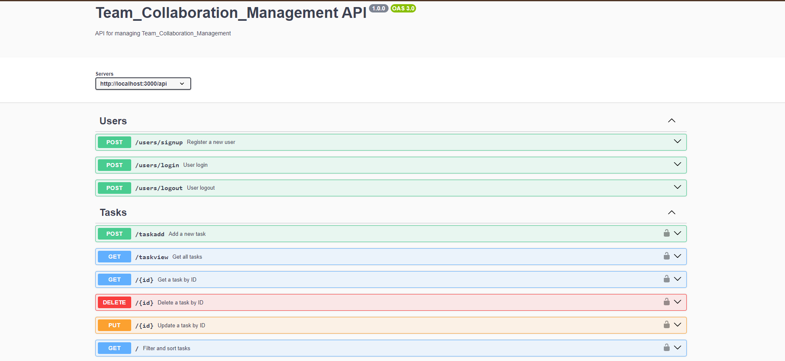

# Team Collaboration Hub

## Objective
Develop a secure and functional backend for the Team Collaboration Hub with user authentication, role management, task CRUD operations, and real-time chat functionality.

## Table of Contents
- [Features](#features)
- [Requirements](#requirements)
- [Technologies Used](#technologies-used)
- [Installation](#installation)
- [Usage](#usage)
- [API Endpoints](#api-endpoints)
- [Database Models](#database-models)
- [Security](#security)
- [API Documentation](#api-documentation)
- [Contributing](#contributing)
- [License](#license)

## Features
- **User Authentication**: Secure login and registration with JWT.
- **Role Management**: Admin and User roles with specific permissions.
- **Task Management**: Create, read, update, delete, and filter tasks.
- **Real-time Chat**: Integrated chat functionality using Socket.IO for project-specific communication.
- **API Documentation**: Comprehensive API documentation with sample requests and responses.

## Requirements
1. **Authentication & Role-Based Access**
   - Implement JWT for secure user authentication.
   - Set up roles for Admin and User, with corresponding permissions.
   
2. **API Development**
   - Build endpoints for:
     - User registration, login, and role assignment.
     - Task management: create, update, delete, and filter tasks by different criteria.
     - Real-time chat with Socket.IO integration for project-specific chat rooms.

3. **Database Setup**
   - Use MongoDB to store users, tasks, and chat messages.
   - Create models for each data type with appropriate schema and relationships.

4. **Security & Middleware**
   - Apply authentication middleware for protected routes.
   - Use basic security practices like Helmet and CORS.

5. **API Documentation**
   - Document all endpoints using Postman with sample requests and responses.


   ## Expense Swagger UI
   
   
   <br>
   

## Technologies Used
- **Node.js**: Backend runtime environment.
- **Express.js**: Web framework for building APIs.
- **MongoDB**: NoSQL database for data storage.
- **Mongoose**: ODM library for MongoDB and Node.js.
- **Socket.IO**: Real-time communication library.
- **JWT (JSON Web Tokens)**: For authentication.
- **Postman**: For API testing and documentation.
- **Helmet**: Security middleware for HTTP headers.
- **CORS**: Middleware for Cross-Origin Resource Sharing.

### Setup .env file

```bash
DATABASE_URL=Your_mongo_url
PORT=Sevice_port
NODE_ENV=NODE_ENVIRINMENT
JWT_SECRET=jwt_secret
```

### Run this app locally

```shell
npm run build
```

### Start the app

```shell
npm start
```
